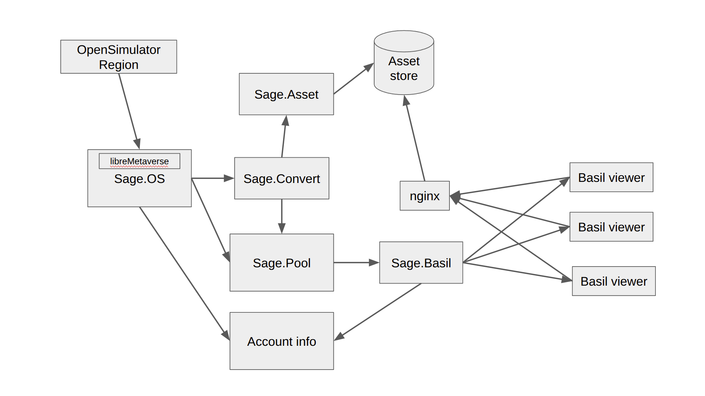

# Design Notes for Sage

This document collects design and architectural notes on the Sage
program. Sage is protocol converted between the [OpenSimulator]/[SecondLife]
viewer protocol and the [Basil protocol].

Since the [Basil protocol] is build around "space servers", a Sage
instance effectivily sits in front of each [OpenSimulator] region
and serves up that region's space.

The viewer connects to all the space-server in the view.
For [OpenSimulator], that could mean many, many space-servers
because each [OpenSimulator] region is only 256x256 and thus
there is the current region, the 8 surrounding regions, and, potentially,
the 16 regions around those. That's 25 space-servers.
Longer views could be more.

TODO: Think about longer views and how to implement the distance queries
so aggrigation of space-server is possible. Does the space-server
discovery service handle this? That implies space-server registration
could inform the discovery service of aggregated collections.
This would also mean that space-server discovery includes a distance query.

## Above Sage

Each Sage instance is front ending an [OpenSimulator] region. There will
exist a service above the Sage instances that organizes the creation of
the instances (maybe only instantiated when a user is in a region) and
handles authentication/authorization for access to the Sage instances.

This service could handle space-server discovery or be an assistant service
to the space-server registration and discovery service.

## OpenSimulator Side

On the [OpenSimulator] side of the converter, [libreMetaverse] library
will be used to talk to the region server. 

This portion will:

- convert objects to GLTF format and update the asset database
- process updates and update the space-server BItem store

## Basil Side

The Basil side manages multiple connections from Basil viewers.
This means keeping multiple sets of authentication/authorization
information as well as managing multiple connections.

## Basil Connections

Basil viewer connections have a **transport** and a **protocol**.
These are managed separately and are negotiated with each
Basil viewer connection. That is, one connection could be
"WebTransport/MessagePack" while a different connection
(to a different viewer) is "/JSON". 

I am leaning toward WebTransport and MessagePack but other
forms might be used especially while debugging.

## Sage.Pool Store

The contents of the space managed by the Sage space-server is
collection of <code>BItems</code>.
This collection is essentially all of the items that are
in the space controlled by the space-server.
It includes a reference to any displayable information
for this item as well as the physical placement and motion
information. The collection of BItems does not include
any large data (meshes, sounds, ...). It only includes
pointers to any displayable.

BItems generate events. The Basil side subscribes to update
events and thus passes changes to the viewer.

The region data (object, position, ...) could be kept
in a database also so that regions can be easily restarted.
What is the tradeoff between in-memory data vs databased data?
In-memory enables the quick, transient updates (changing textures
or prim parameter changes). A backing database that is lazily updated
could work. The other end is to have a "save region data" operation
the dumps all current region data into storage. The "save region data"
would take periodic snapshots and be used at shutdown.
For [OpenSimulator] is this needed at all since region startup
dumps all region data to the viewer?

## Account Info Store

There is an store that is 

## Sage Block Diagram

The following diagram shows the relationship of the main components:

Multiple "Basil viewers" connect to the Sage.Basil modules.
The Sage.Basil modules use the "account info" to authenticate
the connection from the "Basil viewer". Once authenticated, Sage.Basil
queries the Sage.Pool to find entities to send to the "Basil viewer"
for display in the 3d scene. 

The query into Sage.Pool causes events to Sage.OS which causes Sage.OS
to connect to the [OpenSimulator] region using information from "Account info".
The connection to the [OpenSimulator] region causes entity information to come from
the region. Sage.OS checks to see if the entity already exists in the "Asset Store"
by consulting Sage.Asset. If the entity doesn't exist, Sage.Convert is called to
create a properly formatted asset/entity (usually conversion from OpenSimulator prim
format to GLTF).

Once the entity is converted into an asset and its metadata, the metadata is
placed in Sage.Pool which causes events to Sage.Basil which might sent
updates to the viewers.

The 3d entities are split into two pieces: "metadata" and "assets". The "metadata"
has information about position and ownership while "assets" would be the
actual content of the entity. For instance, the metadata of a mesh would
identify the mesh asset and where it is located in the 3d space while the
actual mesh vertex information is stored as an "asset". The viewers
access the asset portion of the entity through a reverse proxy gateway
which, besides accessing the "Asset store", provides access authentication.

## Code Conventions

The brace style will be K&R ("1TBS").

Sage will use a Dependency Injection design using the
Microsoft.Extensions.DependencyInjection NuGet library.
Most of the classes will accept their dependencies in the
class definition. This will enable testing of individual classes.

Configuration will be implemented using
Microsoft.Extensions.Configuration NuGet library

Logging will use
Microsoft.Extension.Logging NuGet library.

[Basil]: https://herbal3d.org/Basil
[Basil protocol]: https://herbal3d.org/BasilProtocol
[OpenSimulator]: http://opensimulator.org
[SecondLife]: https://secondlife.com
